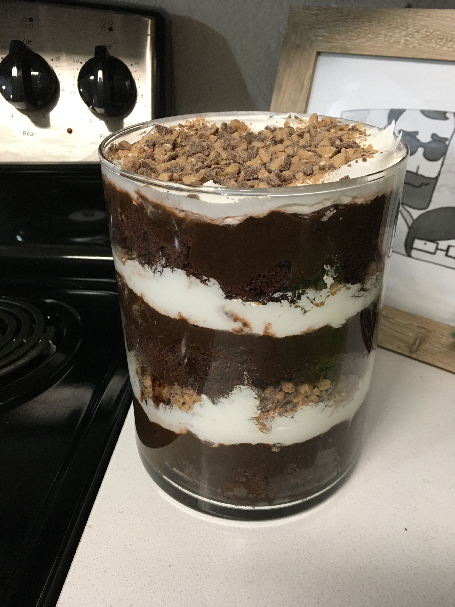

# Giant Chocolate Trifle

Our family's traditional New Year's Eve sugar bomb. Prepare your body.

- 1 chocolate box cake with required ingredients
- 1 quart of chocolate pudding (usually 2 small boxes of pudding mix)
- 2 tubs of Cool Whip
- 9 Heath bars (or an equivalent volume of chocolate-covered toffee bits)

First, prepare all the components:

- Prepare and bake the sheet cake per the box's instructions and allow to cool.
  Cut into small cubes (an inch or two square).
- Combine pudding ingredients and cool it in the fridge.
- Defrost Cool Whip in the fridge until it's soft.
- Crush Heath bars into small chunks.

Combine ingredients by dividing amounts of each component into quarters and
layering them into a trifle dish, starting with cake, then pudding, then Cool
Whip, then Heath bar chips.

Feel free to serve immediately after assembly, but I think it's a bit better
after marinating in the fridge overnight.

---

