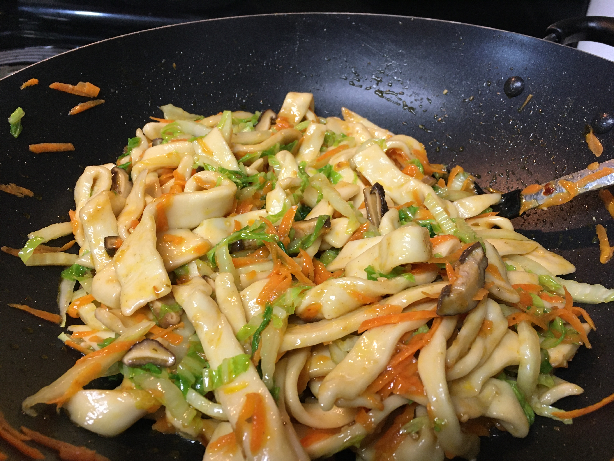

# Knife-Cut Noodles

These are intended to be used as a component in a stir-fry, so you'll want to
have a stir-fry plan in place, too.

This isn't super authentic, but it also doesn't require any special tools,
ingredients, or training, so it's a nice compromise.

- 4 c. bread flour (*not* all-purpose flour)
- 1 c. water

Put bread flour in a mixing bowl and slowly (1/8 c. at a time) mix in the water
with a couple chopsticks. Once combined the dough should look ragged and a
little dry (but add a bit more water if it's falling apart).

Knead the dough for 5 minutes. Then wrap it in plastic wrap (or a gallon freezer
bag) and let it sit on the counter for 15 minutes to let the flour hydrate.

Again, knead for 5 minutes, wrap, and let sit for another 15 minutes.

Knead it a third time for 5 more minutes, wrap, and let sit in the fridge for 30
minutes.

Unwrap the dough, rip off a big chunk, flatten it out on a cutting board with a
rolling pin to your desired noodle width, and cut off your noodles with a sharp
knife. Continue tearing, rolling, and cutting until you're done. Make sure to
dust your noodles in some flour to keep them from sticking together.

Meanwhile, bring a large saucepan of salted water to a boil. Add noodles and
cook just until the water returns to a boil. Drain and rinse the noodles with
cold water so they stop cooking.

They're ready for frying, so prep your stir-fry! Add the noodles near the end,
but they'll still benefit from a couple minutes of stir-frying.

Drizzling a little sesame oil on 'em is a nice touch.

---

