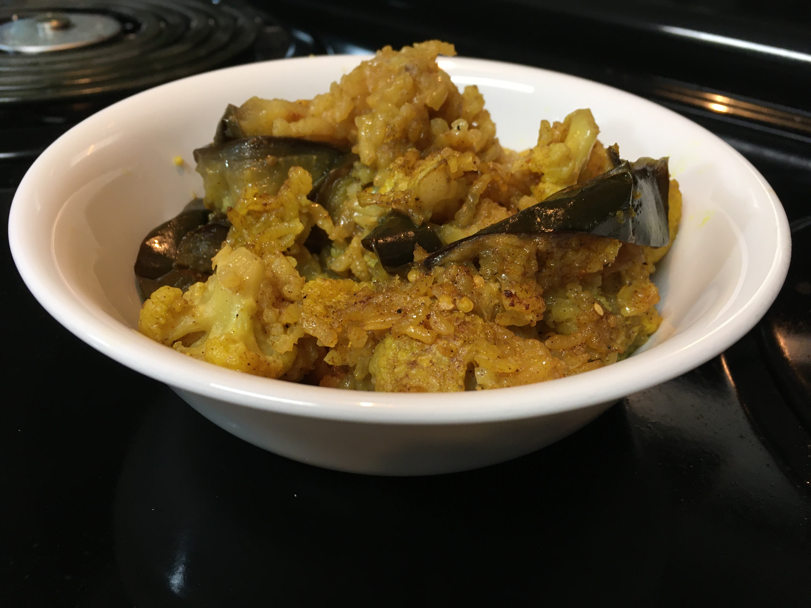

# Maqluba

- 1 2/3 c. rice, rinsed
- 1 tsp. turmeric
- 1 tsp. cinnamon
- 1 tsp. allspice
- 1 tsp. cumin
- 1 tsp. coriander
- salt and pepper
- 1/2 tsp. cloves
- 2 medium eggplants, cut into 1/4-inch-thick slices
- 5 tbsp. olive oil
- 1 medium cauliflower, chopped into florets
- 1 tbsp. melted butter (or more oil, to make it vegan)
- 3 tomatoes, cut into 1/4-inch-thick slices
- 4 c. vegetable stock
- 2 cloves garlic, peeled and roughly chopped

Preheat oven to 400°F. Cover rice with water, stir in 1 tsp. salt, and let soak.

Combine spices in a small bowl.

Toss eggplant slices with 3 tbsp oil, 1/3 of the spice mixture, and salt and
pepper to taste. Lay eggplant on two baking sheets and roast until eggplant is
browned and tender, turning slices once, about 20 minutes.

Toss cauliflower with 2 tbsp oil, 1/3 of the spice mixture, and salt and pepper
to taste. Lay cauliflower on baking sheet and roast, stirring once, until
cauliflower is browned and tender, about 20 minutes.

Assemble: line the bottom of a pot with a circle of parchment paper and brush
paper and sides of pot with melted butter. Assemble tomato slices in a circle,
covering bottom of pot and overlapping the slices. Follow with the eggplant.
Arrange cauliflower over eggplant. Drain rice thoroughly, then spread over
cauliflower. Stir remaining spice mixture and 1 tsp salt into vegetable stock,
and pour over rice. Scatter garlic pieces over top.

Bring stock to a boil over high heat, then reduce heat to low. Cover pot with a
tight-fitting lid and simmer for 30 minutes.

Let dish sit covered for 10 minutes. Quickly invert rice dish onto a large round
platter; do not remove pot for 2-3 minutes. Remove pot and circle of parchment.

Serve with plain yogurt, hot sauce, and chopped fresh cilantro, if desired.

---

