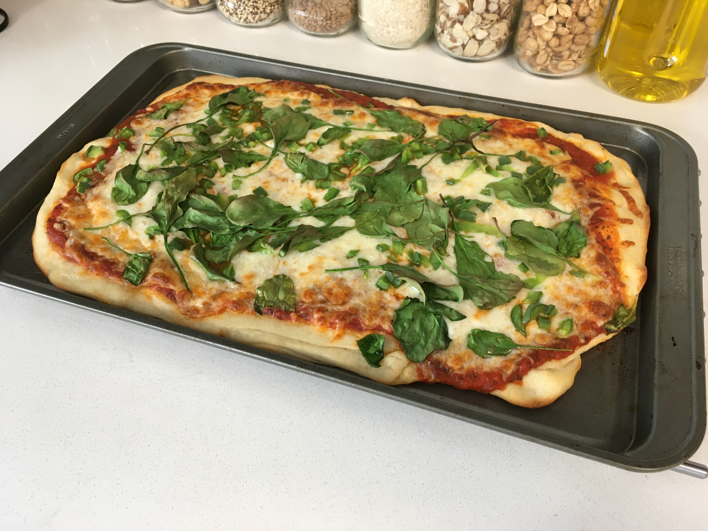

# Pizza

- 1 tsp. active dry yeast
- ¾ c. warm water
- 2 c. bread flour (*not* all-purpose flour)
- 1½ tsp. salt
- 1 tbsp. vegetable oil
- 3 tbsp. olive oil
- 1 c. pizza sauce (or pasta sauce, with some garlic and oregano)
- ⅔ lb. mozzarella cheese
- ¼ lb. Parmesan cheese
- toppings, as desired

Combine yeast and warm water in a mixing bowl. Add salt and flour, mixing into a
rough dough. Knead dough for 5 minutes, roll it in a splash of vegetable oil,
cover in the bowl, and let rise for an hour.

Preheat oven to 500°.

Cover a baking sheet with parchment paper (or dust it with cornmeal).

Spread dough to fill the whole sheet, or until the dough is about ¼" thick.
Brush dough with olive oil: this adds flavor and crisps up the crust, so be sure
to brush all the way out to the edges. Sprinkling a bit of cornmeal on the oiled
edges of the crust adds some nice texture, too.

Cover in sauce, mozzarella, Parmesan, and any toppings you'd like. Bake for
8--10 minutes or until the crust is golden brown. Let cool for a couple minutes,
cut, and serve.

---

Topped with diced bell peppers and spinach.
